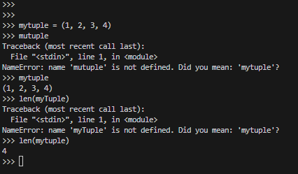
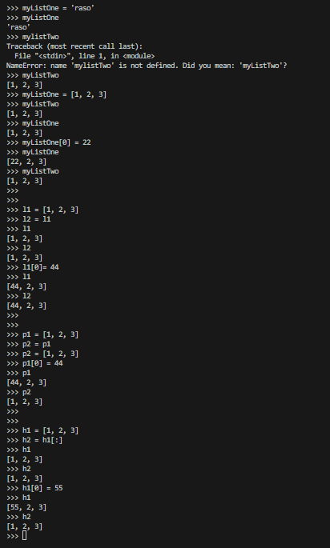

# Object types / Data types

- ***Numbers*** : 1234, 3.1415, 3+4i, 0b111, Decimal(), Fraction()
- ***String*** : 'sapm', "Bob's", b'a\x01c', u'sp\xc4m'
- ***List*** : [1, [2, 'three'], 4.5], list(range(10))
- ***Tuple*** : (1, 'sapm', 4,  'U'), tuple('spam'), nametuple
- ***Dictionary*** : {'food': 'sapm', 'taste': 'yum'}, dict(hours=10)

- ***Set*** : set('abc'), {'a', 'b', 'c'}

- ***File*** : open('egg.txt'), open(r'C:\ham.bin', 'wb')

- ***Boolean*** : true, false
- ***None*** : None
- ***Function***, ***Module***, ***classes***

- ***Advance***: Decorators, Generators, Iterators, MetaProgramming

